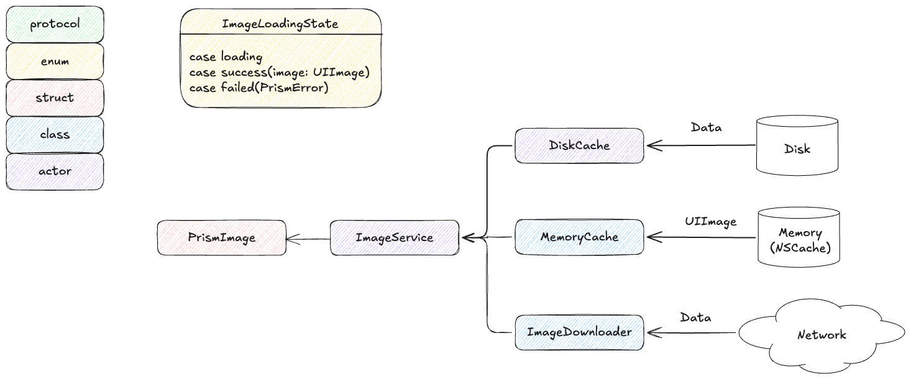

# Prism


SwiftUI의 [AsyncImage](https://developer.apple.com/documentation/swiftui/asyncimage)는 캐싱을 지원하지 않아 동일한 URL에 대해 매번 네트워크 요청이 발생합니다. Prism은 2단계 캐시(메모리 + 디스크)와 중복 요청 방지를 통해 이 문제를 해결합니다.

---

## 데모
|`AsyncImage` 사용|`PrismImage` 사용|
|---|---|
| <video src="https://github.com/user-attachments/assets/c329b930-f0e5-49f4-9bf4-c5f3015fecb8"> | <video src="https://github.com/user-attachments/assets/1d19d238-3e88-497a-aa26-04471aa4e2fa"> |

---

## ✨ 주요 기능

- **2단계 캐싱**: 메모리 LRU 캐시 + 디스크 LRU/TTL 캐시
- **SwiftUI 네이티브**: `PrismImage` 뷰와 ViewBuilder로 각 상태를 자유롭게 커스터마이징
- **AsyncStream 기반 비동기 이미지 로딩**: AsyncStream을 활용한 실시간 로딩 상태(`.loading` -> `.loaded` / `.failed`) 전달.

## 요구사항

| 항목 | 버전 |
|------|------|
| iOS  | 17.0+ |
| Swift | 6.0+ |


## 설치
Prism은 [Swift Package Manager](https://docs.swift.org/swiftpm/documentation/packagemanagerdocs/)를 통해 설치 가능합니다.  


## 사용법

### 기본 사용

`PrismImage`는 이미지 로딩 상태(`ImageLoadingState`)를 ViewBuilder 클로저로 전달합니다. 각 상태에서 표시할 UI를 자유롭게 정의할 수 있습니다.

```swift
import Prism

PrismImage(url: URL(string: "https://example.com/image.jpg")) { state in
    switch state {
    case .loading:
        ProgressView()
    case .success(let image):
        Image(uiImage: image)
            .resizable()
            .aspectRatio(contentMode: .fill)
    case .failed:
        Image(systemName: "photo")
            .foregroundStyle(.secondary)
    }
}
```

### 고정 크기 지정

`size` 파라미터로 뷰의 크기를 지정할 수 있습니다.

```swift
PrismImage(
    url: URL(string: "https://example.com/image.jpg"),
    size: CGSize(width: 100, height: 100)
) { state in
    switch state {
    case .loading:
        Color.gray.opacity(0.2)
    case .success(let image):
        Image(uiImage: image)
            .resizable()
            .scaledToFill()
    case .failed(let error):
        Color.red.opacity(0.2)
    }
}
.clipShape(RoundedRectangle(cornerRadius: 12))
```

### ImageService 직접 사용

UIKit 환경이나 커스텀 로직이 필요한 경우 `ImageService`를 직접 사용할 수 있습니다.

```swift
// async/await
let image = try await ImageService.shared.fetchImage(for: url)

// AsyncStream (상태 스트림)
for await state in await ImageService.shared.imageStream(from: url) {
    // state: .loading / .success(image:) / .failed(_:)
}
```

---

## 아키텍처

### 캐시 계층 구조

이미지 요청은 아래 순서로 처리됩니다. 상위 계층에서 히트하면 하위 계층은 조회하지 않습니다.

```
요청
 │
 ▼
[메모리 캐시] ──── 히트 ────────────────────► 즉시 반환
 │ 미스
 ▼
[디스크 캐시] ──── 히트 ──► 메모리 캐시 갱신 ► 반환
 │ 미스
 ▼
[네트워크 요청]
 │
 ▼
메모리 + 디스크 양쪽 저장 ──────────────────► 반환
```

---

### 메모리 캐시 (LRU)

**자료구조: 이중 연결 리스트 + 해시맵**

조회와 삽입 모두 O(1)으로 처리하기 위해 두 자료구조를 결합했습니다.

- **해시맵**: URL 키로 노드를 O(1)에 찾기
- **이중 연결 리스트**: 최근 사용 순서 유지 및 O(1) 노드 이동

```
           MRU -------------------------  LRU
[head] <-> [이미지 A] <-> [이미지 B] <-> [이미지 C] <-> [tail]

조회 시: 해당 노드를 head 쪽으로 이동
용량 초과 시: tail 쪽 노드 제거
```

---

### 디스크 캐시 (LRU + TTL)
**TTL (Time-To-Live)**

파일 생성 시각을 기준으로 만료를 판별합니다. 기본 TTL은 7일이며, 만료된 파일은 조회 시 즉시 삭제됩니다.

**LRU eviction**

용량 한도 초과 시 파일 수정 시각을 기준으로 가장 오래전에 사용된 파일부터 삭제합니다.

**캐시 키: SHA-256(URL)**

URL을 그대로 파일명으로 사용하면 경로 구분자(`/`) 등 특수문자 문제가 생깁니다. SHA-256 해시를 사용하여 항상 안전한 64자 파일명을 보장합니다.

| 항목 | 기본값 |
|------|--------|
| TTL | 7일 |
| 최대 용량 | 100 MB |
| 최대 파일 수 | 200개 |


## 🤔 주요 고민과 해결과정
### 이미지 캐싱 시 데이터 타입: UIImage vs Data
- `NSData`
    - 장점: UIImage와 비교해 캐싱 시 메모리 사용 부담이 적음.
    - 단점: 캐싱 후 렌더링을 위해 디코딩, 작업이 필요.
        - JPEG/PNG 이미지의 경우 압축 해제 및 디코딩이 필요함.
        - 디코딩은 CPU Intensive 작업이므로 Hang 발생 우려.
- `UIImage`
    - 장점: 디코딩 된 이미지를 바로 저장하므로 속도 측면에서 이점.
    - 단점: NSData에 비해 메모리 사용량 많음.

**결론**: 캐싱의 주요 목적은 속도 향상입니다. 스크롤 시 빠른 이미지 로딩이 사용자 경험에 직접적인 영향을 미치므로, 메모리 캐시에는 디코딩이 완료된 `UIImage`를 저장합니다.

### MemoryCache의 NSCache를 제거한 이유
`swift-corelibs-foundation`의 [NSCache](https://github.com/swiftlang/swift-corelibs-foundation/blob/main/Sources/Foundation/NSCache.swift) 구현체는 **최소 비용 우선 교체** 방식을 사용합니다.  

그러나 해당 구현체는 Darwin 이외의 플랫폼용이며, 실제 iOS에서 동작하는 구현은 비공개입니다. 공식 문서에도 교체 알고리즘이 명시되어 있지 않아 실제 캐시 교체 로직을 알 수 없습니다.
 
따라서 직접 LRU 캐시를 구현해 **예측 가능하고 일관된 캐시 동작**을 보장했습니다

### MemoryCache의 동시성 안전: actor vs NSLock

메모리 캐시의 연산(`retrieve`, `store` 등)은 모두 `O(1)` 수준의 빠른 작업이므로 actor hop 시 발생하는 스케줄링 오버헤드가 실제 작업보다 클 수 있습니다.

특히 그리드 화면처럼 수십 개의 이미지를 동시에 로드하는 경우 suspend로 인해 오버헤드 영향이 클 수 있습니다.

또한 [Swift Forum](https://forums.swift.org/t/overhead-of-using-actors-at-scale/79466/7)에서도 **단순히 동기화만 필요할 경우 actor보다 lock을 사용하는 것이 효율적일 수도 있다.** 라고 언급합니다.

`NSLock` + `@unchecked Sendable` 조합은 컴파일러의 동시성 검사를 받지 못한다는 단점이 있지만, 캐싱의 핵심 목적인 **빠른 응답 속도**를 위해 actor hop 오버헤드를 제거하는 방향을 선택했습니다.

### 디스크 캐시 키: SHA256
디스크 캐시는 메모리 캐시와 달리 파일 시스템에 데이터를 저장합니다. 만약 URL을 캐시 키 그대로 사용한다면, 다음과 같은 문제가 발생할 수 있습니다.

> `https://cdn.example.com/users/123/profile?size=large&v=2`

- 파일 경로에서 사용할 수 없는 특수문자(`/`, `?`, `&`, `:` ) 존재 가능
- 파일명 길이 제한 초과 가능

따라서 URL을 해싱(`SHA256`)하여 캐시 키를 정의했습니다.
- 특수 문자 없음
- URL 길이에 상관없이 캐시 키의 길이가 도일
- 같은 URL -> 항상 같은 결과 (deterministic)

## 라이선스

Prism은 [MIT 라이선스](LICENSE)로 배포됩니다.
